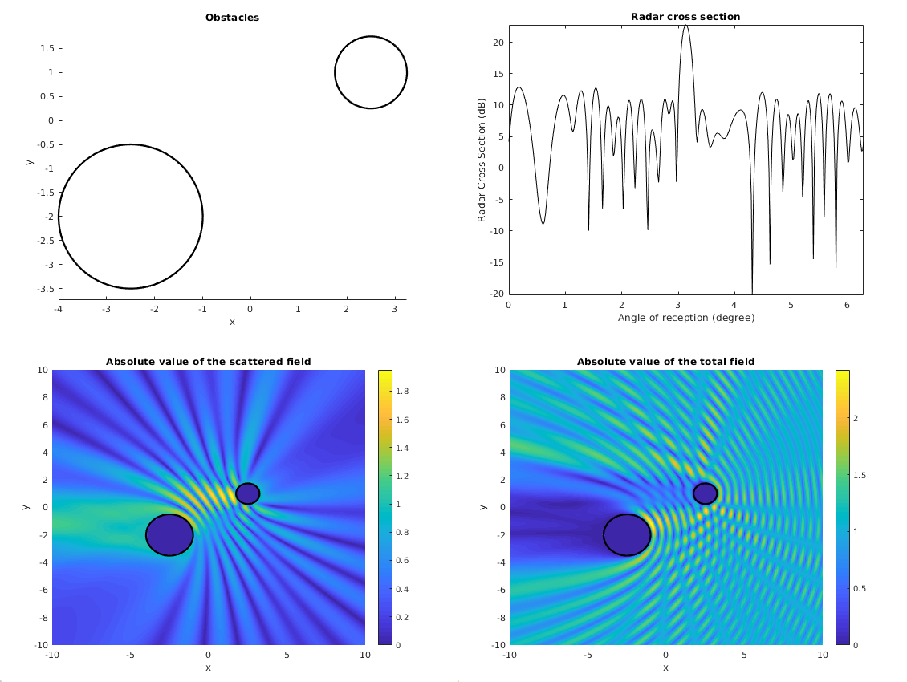

# Mu-Diff: open MATLAB toolbox for solving multiple scattering problems

## Description

Multiple scattering is a highly complex wave problem that finds great applications in many areas of physics and engineering (acoustics, electromagnetism, optics, nanophotonics, elasticity...).

μ-diff or mu-diff (acronym for multiple-diffraction) is an open-source Matlab toolbox for solving multiple scattering problems by clusters of circular cylinders.

Any distribution of the cylinders is possible, deterministic or random, allowing to define basic to complex disordered media. The rigorous mathematical formulation is based on the integral equations formulations. The finite-dimensional approximation technique is a Fourier spectral method combined with linear algebra solvers (direct gaussian elimination method or preconditioned Krylov subspace iterative techniques).


## Documentation and Example

See the `Doc/` and `Examples/` directories for documentation and examples. The reference manual is located in `Doc/` and also on the [web site](http://mu-diff.math.cnrs.fr).

The mu-diff toolbox requieres [the software Matlab](http://www.mathworks.fr/products/matlab/). To install mu-diff, download it and unzip it where you wan. In the MATLAB environment, simply add the directory (and its subdirectories) to the MATLAB path file. You can now use mu-diff and launch some of the examples provided in the `Examples/` folder. For example, in your MATLAB prompt, typing `ExNonPenetrable` will solves a Dirichlet (non penetrable) problem with 2 obstacles using a fast algorithm:

```matlab
>> ExNonPenetrable
-----------------------
    New simulation     
-----------------------
Boundary condition: Dirichlet
Incident wave: PlaneWave
Wavenumber: 6.2832
External Potential: 10% done
External Potential: 20% done
External Potential: 30% done
External Potential: 40% done
External Potential: 50% done
External Potential: 60% done
External Potential: 70% done
External Potential: 80% done
External Potential: 90% done
External Potential: 100% done
```
and a lot of figures including these four ones:



| Position | Legend |
| --- |---|
|Top left| The 2 obstacles|
| Top right| Radar cross section (far field)|
| Bottom right |Scattered fields (color map might differs)|
| Bottom left |Total fields (color map might differs)|


## Easy to use

Build the geometry (2 obstacles)
```matlab
%Geometry
O = [-2.5, 2.5    ; -2, 1];
a = [1.5, 0.75];
N_scat = size(O,2);
```

Set some parameters
```matlab
k = 2*pi; % wavenumber
incident_angle = pi; % angle of incidence
```

Compute the solution
```matlab
Solution = DirichletSolver(O, a, k, 'PlaneWave', pi);
```

Compute some post processing quantity: 

* Radar Cross Section
```matlab
R = DirichletRCS(Solution,  [0:360]*2*pi/360);
figure(1);
plot([0:360]*2*pi/360, R, 'k-');
```
* Near Field
```matlab
[X,Y] = meshgrid([-10:0.1:10], [-10:0.1:10]);
[U_tot, U] = DirichletNearField(Solution, X, Y);
figure(2);
surf(X,Y, abs(U_tot));
view(2)
```
To display the obstacles on the figure, use this snipet instead:
```matlab
[X,Y] = meshgrid([-10:0.1:10], [-10:0.1:10]);
figure(2)
hold on
surf(X,Y, abs(U_tot));
shading interp;
title(['Absolute part of the total field']);
xlabel('x'); ylabel('y');
view(2); colorbar;
PlotCircles(O, a, 2, 'Color', 'k', 'LineWidth', 2, 'zdata', max(max(abs(U_tot))));
set(gcf,'Renderer','Zbuffer');
hold off
```

## Features

### Precomputed Boundary Integral Operators (BIO)

The classical Single-Layer `S`, Double-Layer `K` and their normal derivative, respectively `K*` and `D`, are pre-computed. They can be called independently to build a complete discretized matrix, where each block correspond to the operator on the boundary of one obstacle:
```
S = SingleLayer(O, a, M_modes, k); 
```
wille compute the Single-Layer operator on each obstacles:
$$
S = \begin{pmatrix}
S_{11} & S_{12}\\\\
S_{21} & S_{22}
\end{pmatrix},
$$
where $S_{ij}$ is the trace on $\partial\Omega_j$ (boundary of obstacle $j$) of the single-layer operator of obstacle $\Omega_i$ :
$$
S_{ij}p = \left.\left(\int_{\partial\Omega_i} G(x,y) p(y){\rm d} y\right)\right|_{\partial\Omega_j}
$$

### Flexibility

μ-diff is very flexible and a matrix can be computed "by hand". For example this matrix (with 2 obstacles)
$$
A = \begin{pmatrix}
S_{11} & K_{12}\\\\
K^*_{21} & D_{22}
\end{pmatrix}
$$
can simply be obtained by defining the cell:
```matlab
% Defining the matrix
T = {'S', 'K'; 'K*', 'D'};
A = IntegralOperator(..., T)
```

### Helpful Features

* **Pre-processing**: geometry (placement of obstacles), incident wave (plane or point source type)
* **Post-processing**: near field, far field, radar cross section
* **Ready-to-use Solver**, using hard coded block-jacobi boundary integral equation
* **High Frequency / Fast solving** using Toeplitz stucture of the matrix


## Related software

* [GypsiLab](https://github.com/matthieuaussal/gypsilab): FEM/BEM coupling easy and efficient in MATLAB
* [GetDP](https://getdp.info): FEM solver written in C++ with its own language
* [FreeFem](https://freefem.org): FEM solver written in C++ with its own language
* [FEniCS](https://fenicsproject.org/): Python FEM solver
* [Bem++](https://bempp.com/): Powerful BEM library written in C++
* [GMSH](https://gmsh.info): Mesh generator and data visualization
* [ParaView](https://paraview.org): Data visualization

## License

mu-diff is copyright (C) 2014-2019 X. Antoine and B. Thierry, University of Lorraine, CNRS, France,
and is distributed under the terms of the GNU General Public License, Version 2
or later. See Doc/LICENSE.txt and Doc/CREDITS.txt for more information.
